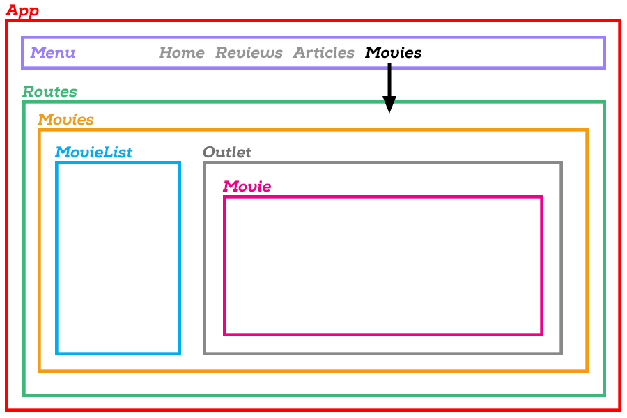

# Cvičení React Router - Filmový magazín

Navazujeme na předchozí cvičení **React Router - Filmy**.

1. Můžeš pokračovat se svým vlastním kódem z předchozího cvičení **React Router - Filmy** a pouze postupovat podle zde zobrazeného návodu. Nebo si můžeš tento repozitář forknout a naklonovat - už obsahuje základní řešení předchozího příkladu (bez bonusů, bez stylování).

2. Pokud si děláš fork a klon tohoto repozitáře, tak nezapomeň potom na příkazové řádce spustit:
	```
	npm install
	```

3. Aplikace by měla být ve stavu, že v hlavní `App` máme dvě `<Route>`, z nichž jedna zobrazuje seznam filmů `<MovieList />` a druhá detail filmu `<Movie />`. Z detailu filmu se můžeme vrátit zpět na hlavní stránku s přehledem filmů.

## Pokračujeme a vylepšujeme

Chceme z naší aplikace udělat filmový magazín. Celý web bude mít několik stránek:
- Home (úvodní stránka)
- Reviews (recenze filmů)
- Articles (články)
- Movies (filmy, které právě běží v kině)

1. Komponenty, které už máme hotové nechme být - použijeme je za chvíli.

2. Vytvořme nové komponenty `Home`, `Reviews`, `Articles` a dejme jim nějaký základní obsah - opět stačí třeba jen nadpis a odstavec textu. Obsah není podstatný, jde nám o fungování webu s pomocí routeru.

4. Vytvořme ještě jednu novou komponentu `Movies`, kterou zatím nechme prázdnou. Prozatím ať vypisuje třeba jen odstavec s textem *Tady budou filmy*.

5. Vytvořme si komponentu `Menu`, která bude obsahovat hlavní menu našeho webu. V komponentě `Menu` vytvoříme pomocí Router komponenty `Link`  odkazy na hlavní stránky našeho webu, např. takto:

	```jsx
	<nav className="menu">
		<Link to="/">Home</Link>
		<Link to="/reviews">Reviews</Link>
		<Link to="/articles">Articles</Link>
		<Link to="/movies">Movies</Link>
	</nav>
	```

	Pokud máš chuť, přidej si HTML a CSS podle libosti, aby komponenta vypadala jako skutečné menu.

6. Vlož `Menu` do `App` někam na začátek, abychom mohli na vytvořené stránky navigovat.

	Pod menu jsou `<Routes>`, které tam máme z předchozího příkladu. Vymažme jednotlivé cesty `<Route />`, které tam jsou teď, a nahraďme je cestami na naše 4 hlavní stránky Home, Reviews, Articles a Movies.

	Vyzkoušej, že aplikace funguje a že klikání na odkazy přepíná mezi stránkami.

7. Pojďme teď dodělat stránku/komponentu Movies. Chceme, aby fungovala podobně jako naše původní aplikace, ale lépe. *More better!*, jak říká našinec.

	Chceme, aby stránka zobrazovala vlevo seznam filmů `MovieList` (ten už máme hotový), který na stránce bude stále vidět. Když se v seznamu klikne na film, zobrazíme jeho detail vpravo vedle seznamu.

	Adresa `'/movies` nás tedy dostane na stránku se seznamem vlevo, kde vpravo nebude nic.
	Adresa `'/movies/:id` nás dostane na stejnou stránku se seznamem, kde ale vpravo už bude detail konkrétního filmu.

	Můžeme využít toho, že cesty jsou v React Routeru (od verze 6) do sebe vnořovat.

8. V komponentě `Movies` budeme mít dvě věci. Komponentu `MovieList` (seznam filmů) a React Router komponentu `Outlet`.

	Komponenta `Outlet` je prázdné místo, kam React Router vloží komponentu z vnořené cesty (viz dále). Můžeš se podívat na [dokumentaci](https://reactrouter.com/docs/en/v6/api#outlet).

	Kód komponenty `Movies` by tedy měl vypadat třeba nějak takto:
	```jsx
	<>
		<h1>Movies</h1>
		<p>V kinech právě hrají:</p>

		<div className="movies">
			<MovieList />
			<Outlet />
		</div>
	</>
	```

	Nezapomeň `Outlet` naimportovat z React Routeru:
	```jsx
	import {Outlet} from 'react-router-dom';
	```

	Do komponenty doplníme jednoduché CSS, které nám dá `<MovieList />` a `<Outlet />` na stránce hezky vedle sebe:
	```css
	.movies {
		display: grid;
		grid-template-columns: 1fr 3fr;
		gap: 30px;
	}
	```

	Pokud chceš, můžeš do komponenty později přidat dalčí HTML a CSS, aby stránka vypadala ještě lépe.

9. V hlavní `App` zatím máme cesty pouze pro 4 hlavní stránky, které jsi přidala v bodě 6. Tvůj kód by měl vypadat nějak takto:
	```jsx
	<Routes>
		<Route path="/" element={ <Home /> } />
		<Route path="/reviews" element={ <Reviews /> } />
		<Route path="/articles" element={ <Articles /> } />
		<Route path="/movies" element={ <Movies /> } />
	</Routes>
	```

10. Nyní chceme zařídit, aby se detail filmu s adresou `'/movies/:id'` zobrazil uvnitř komponenty `Movies` v prostoru, který jsme React Routeru vyznačili pomocí komponenty `Outlet`.

	Upravíme cesty tak, aby do cesty vedoucí na `'/movies'` byla **vnořená** cesta pro detail filmu. Pokud cesty vnoříme do sebe, uvádí se adresa vnořené cesty vždy relativně k rodičovské cestě (tzn. už neuvádíme celou adresu od domovské stránky, ale pouze ten kousek, který následuje za adresou rodičovské cesty).

	Náš kód upravíme následovně:
	```jsx
	<Routes>
		<Route path="/" element={ <Home /> } />
		<Route path="/reviews" element={ <Reviews /> } />
		<Route path="/articles" element={ <Articles /> } />
		<Route path="/movies" element={ <Movies /> } >
			<Route path=":id" element={ <Movie /> } />
		</Route>
	</Routes>
	```

	Všimni si, že jsme z `<Route>` vedoucí na `'/movies'` odstranili lomítko na konci - ze samozavírací značky jsme udělali tradiční párovou značku, abychom do ní mohli uzavřít vnořenou `<Route />` vedoucí na `':id'`.

11. Vyzkoušej, že naše aplikace funguje jak má.

12. Uvědom si, proč to všechno děláme a jak je to vlastně super :)

	- Můžeme v naší apliakci mít více stránek a přecházet mezi nimi.
	- Každá stránka má vlastní adresu, kterou si návštěvník může zkopírovat a později se na ni vrátit. Schválně si zkus otevřít nové okno prohlížeče a vlepit do něj třeba adresu `http://localhost:8080/movies/3` - měla by se ti spustit naše aplikace a rovnou se otevřít na stránce Movies s vybraným a zobrazeným filmem La La Land.
	- Díky <Outlet /> můžeme nyní opravdu naši aplikaci skládat z jednotlivých kousků (komponent). Do komponent můžeme přidat tuto "zásuvku", aniž bychom tušili, jaká přesně komponenta se v ní později zobrazí. To určí a zařídí Router podle toho, jak jsou do sebe logicky vnořené cesty.

13. Celá naše aplikace má nyní takovoutou strukturu:




## Bonus

14. V komponentě `Menu` i v komponentě `MovieList` použij místo `Link` komponentu `NavLink` a nastyluj CSS třídu pro aktivní odkaz tak, abychom v  viděli, který film je zrovna vybraný.

	Když to uděláš správně, měla by se ti v hlavním menu nějak zvýrazňovat sekce webu, ve ktré se nacházíme (Home, Reviews, Articles, Movies). Když klikneš na Movies, měl by se ti v seznamu filmů nějak zvýrazňovat aktuálně zobrazený film.

	Podívej se do [dokumentace](https://reactrouter.com/docs/en/v6/api#navlink). Dokumentace bohužel není moc výřečná, ale když budeš pozorná, tak se tam dočteš, že do atributu `className` komponenty `NavLink` jde napsat funkce, která automaticky jako parametr dostane hodnotu `true` nebo `false` podle toho, zda je odkaz zrovna aktivní (tj. uživatel je na stránce, na kterou odkaz vede). Podle hodnoty `true/false` můžeš z funkce vrátit název třídy, jakou chceš, aby odkaz dostal. Když si tuto třídu v CSS vhodně nastyluješ, budou se ti odkazy v menu automaticky obarvovat podle toho, na které stránce zrovna budeš.

15. Zařid, aby se při kliknutí na Movie, když ale ještě není vybraný žádný film, zobrazila vpravo informace o tom, že ještě není vybraný žádný film. Vytvoř si třeba komponentu `NoMovieSelected` a přidej ji jako `index` route dovnitř cesty vedoucí na `'/movies'`.

16. Umět, co jsme udělali v předchozím bodu se často hodí, ale v případě naší aplikace bychom raději, kdyby byl automaticky vybraný první film (než abychom jen viděli hlášku, že si máme nějaký film vybrat). Takže když klikneme v hlavním menu na **Movies**, chceme aby se vlevo zobrazil sezam filmů s již vybraným prvním filmem a vpravo detail prvního filmu.

	Nebudeme si teď komplikovat život tím, že budeme zjišťovat, co je **první film**, ale řekněme, že chceme vždy zobrazit **film s ID=1**.

	Potřebujeme tedy, aby se náš odkaz na `'/movies'` automaticky přesměroval na `'/movies/1'`. Router má komponentu `Navigate`, která to umí zařídit.
	Když nastavíš index route tak, aby neukazovala na `<NoMovieSelected />`, ale místo toho na `<Navigate to="/movies/1" />`, tak dojde k přesměrování. Bezva.

17. Nebezva. Zkus v prohlížeči jít na odkaz Movies a použít tlačítko zpět. Pravděpodobně tě bude vracet stále na stránku Movies a "přestane fungovat". Víš proč?

	A doveděš zjistit, proč to spravíš tím, že do komponenty **Navigate** přidáš ještě parametr replace?
	```jsx
	<Navigate to="/movies/1" replace={true} />
	```

	Celé naše `Routes` uvnitř `App` tedy budou vypadat nějak takto:
	```jsx
	<Routes>
		<Route path="/" element={ <Home /> } />
		<Route path="/reviews" element={ <Reviews /> } />
		<Route path="/articles" element={ <Articles /> } />
		<Route path="/movies" element={ <Movies /> } >
			<Route index element={ <Navigate to="/movies/1" replace={true} /> } />
			<Route path=":id" element={ <Movie /> } />
		</Route>
	</Routes>
	```

18. Uprav seznam filmů tak, aby to nebyl pouze obyčejný odkaz s názvem filmu, ale aby tam byl třeba malý obrázek filmu a vedle název a pod ním rok uvedení a dalo se kliknout na celou tuto malou "kartičku".

19. Doplň do aplikace HTML elementy a CSS styl tak, aby celá aplikace vypadala lépe. Ať máme na stránce hezké vodorovné menu, ať se seznam filmů a detail filmu zobrazují vedle sebe a jsou nějak obarvené nebo s rámečkem.

